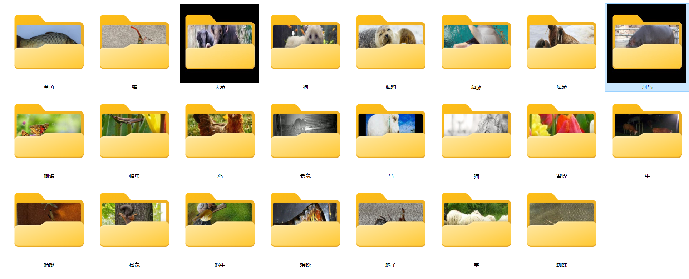
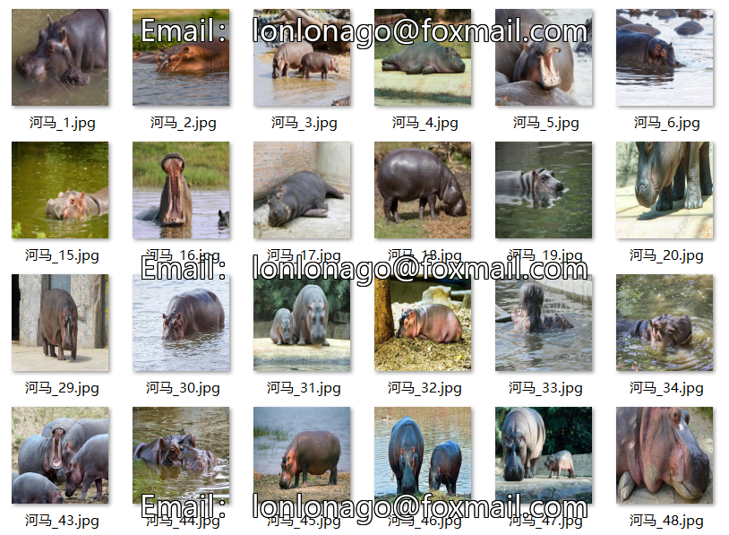
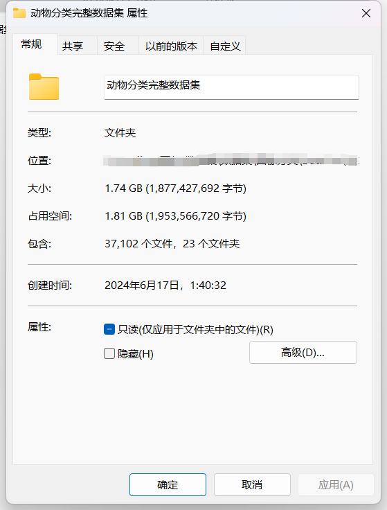
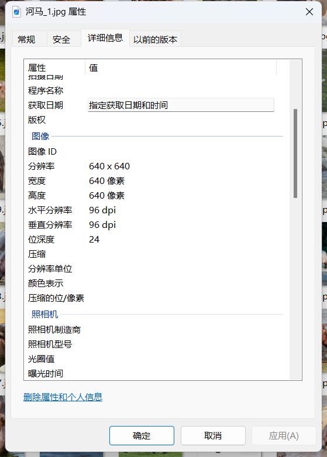

# 23 Types of Common Animal Image Classification Datasets

Dataset Information Introduction: The number of images in the folder "Elephant" is 1446,
The number of images in the folder "Squirrel" is 1862,
The number of images in the folder "Damselfish" is 616,
The number of images in the folder "Sea Otter" is 453,
The number of images in the folder "Sea Lion" is 495,
The number of images in the folder "Sea Lion" is 465,
The number of images in the folder "Cow" is 1866,
The number of images in the folder "Dog" is 4863,
The number of images in the folder "Cat" is 1668,
The number of images in the folder "Sheep" is 1820,
The number of images in the folder "Mouse" is 1078,
The number of images in the folder "Grass Carp" is 1259,
The number of images in the folder "Centipede" is 557,
The number of images in the folder "Snail" is 1000,
The number of images in the folder "Spider" is 4821,
The number of images in the folder "Bee" is 1000,
The number of images in the folder "Dragonfly" is 1000,
The number of images in the folder "Cicada" is 1000,
The number of images in the folder "Scorpion" is 1000,
The number of images in the folder "Locust" is 1000,
The number of images in the folder "Butterfly" is 2112,
The number of images in the folder "Horse" is 2623,
The number of images in the folder "Chicken" is 3098,
The total number of images in all subfolders is 37102.

Screenshot:
+
+
+
To ask questions, just add them directly. No need for friend verification; you can send messages to me without my permission.
When searching for me, just send your questions at once; I will respond to you. Sometimes I am busy, so if you describe clearly what you want and why, I will also reply to you.
I will also reply to you when I have time, without needing formalities, which saves time.
Phone numbers are the same above; I might forget to respond to you or if you're impatient, you can text or call.

## Images

Here is a pay link on Stripe ( https://buy.stripe.com/3cs8yP7sY87d0vu9AB ). Please contact me lonlonago@foxmail.com after funding $89, and I will send you a complete data files , thank you!

